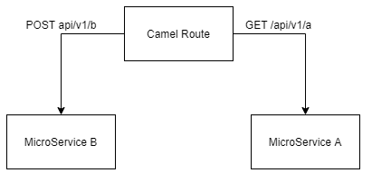

# Apache camel Routing

This project aims to build a simple route who consume rest endpoints. Simulating a integration between two systems.

# Application architecture

The application works as following:



```
The Camel route request MicroService A to get all records, then bypass the content to MicroService A through a POST request sending the all records retrieved on Microservice A. This show a minimal example how to connect two systems using apache camel.
```
# Getting Started

This project show a minimal example how to connect two systems using apache camel

### Prerequisites

You will need a java version installed (11 or later) and a IDE to run locally. (STS or Eclipse EE).

### Installing

I'll give you a hand a tell how to install this project on you own machine.

First, clone the project to your local storage.

Then,

```
After unzip on a directory of your choice, open your favorite java IDE and import the project as maven project
```

Finally,

```
Run the application as spring boot
```

## Built With

- [Spring Boot](https://spring.io/projects/spring-boot) - The web framework used
- [Maven](https://maven.apache.org/) - Dependency Management
- [Apache Camel](https://camel.apache.org/camel-spring-boot/latest/spring-boot.html) 